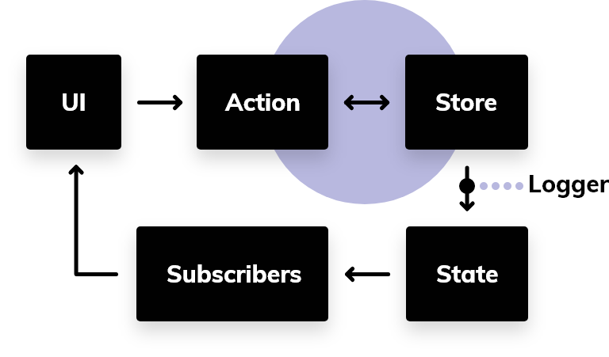
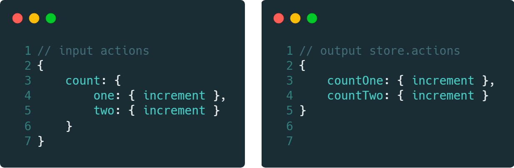

# @atomico/store

[](http://npmjs.com/@atomico/store)
[](https://bundlephobia.com/result?p=@atomico/store)

Little state manager based on spaces, can consume normal functions, asynchronous, generators and asynchronous generators.

## Store

The store allows you to store the status and actions. this will send the subscribers the changes made by the actions, **the changes generated by the actions must be immutable, since it is the only way to send a new state to the subscribers**.

### Flow of the store



### Creation of a store

```js
let {actions,state, subscribe} = Store( initialActions[, initialState[, logger]]);
```

- `initialActions` : grouping of actions.
- `[initialState]` : initial state.
- `[logger]`: function that read the modifications issued.
- `actions` : actions created by the store from `initialActions`.
- `state` : current state of the store
- `subscribe` : allows subscribing a function to the store, this returns a function layers to eliminate the subscription.

### Store example

```js

import {Store} from "@atomico/store";

function *takeoff(){
    yield "tree" // state {rocket:"tree"}
    yield "thow" // state {rocket:"two"}
    yield "one"  // state {rocket:"one"}
    return "🚀 takeoff!" // state {rocket: "🚀 takeoff!"}
}

let store = Store({rocket:{takeoff}})

store.actions.rocket.takeoff().then(()=>{
    console.log("done")
})
    
store.subscribe((state)=>{
    console.log(state) 
})

```

## spaces

The spaces are aliased to store the state of the actions, the following example shows how `@atomico/store` simplifies access to the action through the camelCase pattern.



The objective of this is to simplify the maintenance of the store, limiting the status and actions only to a depth level.

## action

function that allows the store to change state, actions can be simple in return, like the one shown below

```js
export function increment(state=0){
    return state+1;
}
```

Actions can also have a simple asynchronous behavior:

```js
export function increment(state,payload){
    return fetch(payload.url).then((response)=>response.json())
}
```

> to action, you can receive a second argument transmitted by the ** UI **, in this case that argument is `payload`

The potential use of `@atomico/store`, is the recursive reading allowing a conversation between the action and the store with the use of [**generators**](https://developer.mozilla.org/es/docs/Web/JavaScript/Referencia/Objetos_globales/Generador)

```js
export function *increment(state) { 
	  yield  1;
	  yield  2;
	  return 3;
}
```

Recursive reading? ... the store reads the return of the action and consumes it until the end of its reading, be it a promise or a generator

```js
function *generatorIncrement1to3(){
    yield 1;
    yield 2;
    return 3;
}
function *generatorIncrement3to6(){
    yield 4;
    yield 5;
    return 6;
}
export function *increment(state) { 
	  yield  generatorIncrement1to3();
	  return  generatorIncrement4to6();
}
```

The benefit of this is that you can communicate to the subscribers the current status of a process with the intention of following its execution.

```js
export function *request(state={},payload){
    if(state.loading)return state;// does not emit change
    yield  {loading:true}; // Emit change
    return fetch(payload.url)
    		.then((res)=>res.json())
    		.then((data)=>{loading:false,data});  // Emit change
}
```

The support applies even to asynchronous generators.

```js
export async function *request(state={},payload){
    if(state.loading)return state;// does not emit change
    yield  {loading:true}; // Emit change
    let res = await fetch(payload.url),
        data = await res.json();
    return {loading:false,data}; // Emit change
} 
```


## Components

`@atomico/store/components` allows access to the store through components and hooks.

### Provider

Necessary context to invoke `a Store` at component runtime.

```jsx
import { h, render } from "@atomico/core";
import { Store } from "@atomico/store";
import { Provider } from "@atomico/store/components";
import App from "./app";

let store = Store(
    // actions
    {count : {
        increment(state){
            return state+1
        }
    }},
    // initialState
    {count:0}
)

render(
    <Provider store={store}>
        <App/>
    </Provider>
)
```

### Consumer

allows you to consume and subscribe to the content of the store.

```jsx
<Consumer space={optionalSpace}>
    {(state,actions)=>{

    }}
</Consumer>
```

### useStore

useStored to access the context created by the `<Provider/>` component, obtaining by default the actions and the global state. this hook also allows the suscrición before the changes of the store.

```jsx
import { h } from "@atomico/core";
import { useStore } from "@atomico/store/components";

export function App(){
    let [ state ,actions]= useStore();

    return <div>
        <h1>count : {state.count}</h1>
        <button onClick={action.count.increment}>increment</button>  
    </div>
}
```

### useStore with nameSpace

allows to subscribe to changes only from a nameSpace, in turn groups the actions avoiding the use of the space selector.

```jsx
import { h } from "@atomico/core";
import { useStore } from "@atomico/store/components";

export function App(){
    let [ state, actions ] = useStore("count");

    return <div>
        <h1>count : {state}</h1>
        <button onClick={action.increment}>increment</button>  
    </div>
}
```