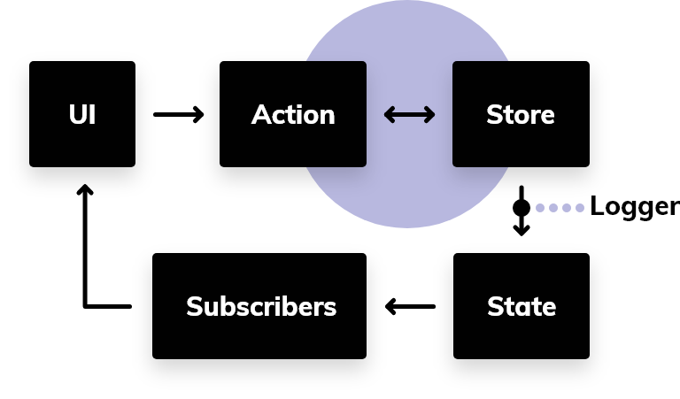
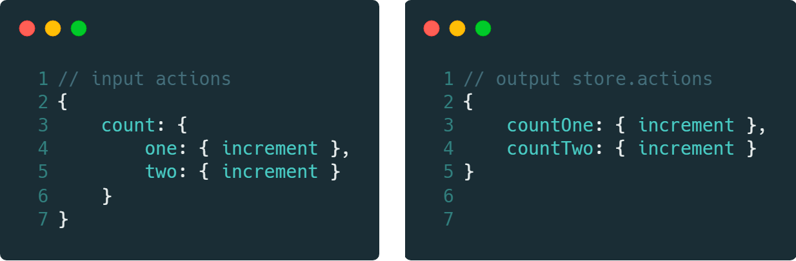

# @atomico/store

[](http://npmjs.com/@atomico/store)
[](https://bundlephobia.com/result?p=@atomico/store)

Pequeño gestor de estados  a base de espacios, capas de consumir funciones normales, asíncronas, generadores y generadores asíncronos de forma recursiva.

## Store

El store permite almacenar el estado y acciones. este despachara a los suscriptores los cambios realizados por las acciones, **los cambios generados por las acciones deben ser inmutables, ya que es la única forma de despachar un nuevo estado a los suscriptores**.

### Flujo del store



### Creación de un store

```js
let {actions,state, subscribe} = Store( initialActions[, initialState[, logger]]);
```

- `initialActions` : agrupación de acciones
- `[initialState]` : estado inicial
- `[logger]`: función capas de leer las modificaciones emitidas 
- `actions` : acciones creadas por el store desde `initialActions`
- `state` : estado actual del store
- `subscribe` : permite suscribir una función al store, este retorna una función capas de eliminar la suscripción .

### Ejemplo de Store

```js

import {Store} from "@atomico/store";

function *takeoff(){
    yield "tree" // state {rocket:"tree"}
    yield "thow" // state {rocket:"two"}
    yield "one"  // state {rocket:"one"}
    return "🚀 takeoff!" // state {rocket: "🚀 takeoff!"}
}

let store = Store({rocket:{takeoff}})

store.actions.rocket.takeoff().then(()=>{
    console.log("done")
})
    
store.subscribe((state)=>{
    console.log(state) 
})

```

## espacios

Los espacios son alias para almacenar el estado de las acciones, el siguiente ejemplo enseña como `@atomico/store`simplifica el acceso a la acción mediante el patrón camelCase.



EL objetivo de esto es simplificar la mantención del store, limitando el estado y las acciones solo a un nivel de profundidad.

## acción

función que permite comunicar al store cambio de estado, las acciones pueden ser simples en retorno, como el que se enseña a continuación

```js
export function increment(state=0){
    return state+1;
}
```

Las acciones pueden también poseer un comportamiento asíncrono simple:

```js
export function increment(state,payload){
    return fetch(payload.url).then((response)=>response.json())
}
```

> la acción, puede recibir un segundo argumento transmitido por la **UI** 

pero el potencial de uso de `@atomico/store`, es la lectura recursiva permitiendo una conversación entre la acción y el store con el uso de [**generadores**](https://developer.mozilla.org/es/docs/Web/JavaScript/Referencia/Objetos_globales/Generador)

```js
export function *increment(state) { 
	  yield  1;
	  yield  2;
	  return 3;
}
```

¿Lectura recursiva?... el store lee el retorno de la acción y lo consume hasta finalizar su lectura sea de una promesa o un generador

```js
function *generatorIncrement1to3(){
    yield 1;
    yield 2;
    return 3;
}
function *generatorIncrement3to6(){
    yield 4;
    yield 5;
    return 6;
}
export function *increment(state) { 
	  yield  generatorIncrement1to3();
	  return  generatorIncrement4to6();
}
```

El beneficio de esto es que ud puede comunicar a los suscriptores el estado actual de un proceso con la intención de seguir su esjecución.

```js
export function *request(state={},payload){
    if(state.loading)return state;// no emitira cambio a los suscriptores
    yield  {loading:true}; // se emite a los suscriptores
    return fetch(payload.url)
    		.then((res)=>res.json())
    		.then((data)=>{loading:false,data});  // se emite a los suscriptores
}
```

El soporte se aplica incluso a las los generadores asíncronos.

```js
export async function *request(state={},payload){
    if(state.loading)return state;// no emitira cambio a los suscriptores
    yield  {loading:true}; // se emite a los suscriptores
    let res = await fetch(payload.url),
        data = await res.json();
    return {loading:false,data}; // se emite a los suscriptores
} 
```
## Componentes

`@atomico/store/components` ofrece acceso al store mediante componentes y hooks.

### Provider

Contexto necesario para invocar `useStore` en tiempo de ejecución del componente.

```jsx
import { h, render } from "@atomico/core";
import { Store } from "@atomico/store";
import { Provider } from "@atomico/store/components";
import App from "./app";

let store = Store(
    // actions
    {count : {
        increment(state){
            return state+1
        }
    }},
    // initialState
    {count:0}
)

render(
    <Provider store={store}>
        <App/>
    </Provider>
)
```

### Consumer

permite consumir y suscribirse al contenido del store.

```jsx
<Consumer space={optionalSpace}>
    {(state,actions)=>{

    }}
</Consumer>
```

### useStore

useStore accede al contexto creado por el componente `Provider`, obteniendo por defecto las acciones y el estado global. este hook también permite la suscrición ante los cambios del store.

```jsx
import { h } from "@atomico/core";
import { useStore } from "@atomico/store/components";

export function App(){
    let [ state ,actions]= useStore();

    return <div>
        <h1>count : {state.count}</h1>
        <button onClick={action.count.increment}>increment</button>  
    </div>
}
```

### useStore con nameSpace

permite suscribirse a los cambios solo de un nameSpace, a su vez agrupa las acciones evitando el uso del selector de espacio.

```jsx
import { h } from "@atomico/core";
import { useStore } from "@atomico/store/components";

export function App(){
    let [ state, actions ] = useStore("count");

    return <div>
        <h1>count : {state}</h1>
        <button onClick={action.increment}>increment</button>  
    </div>
}
```